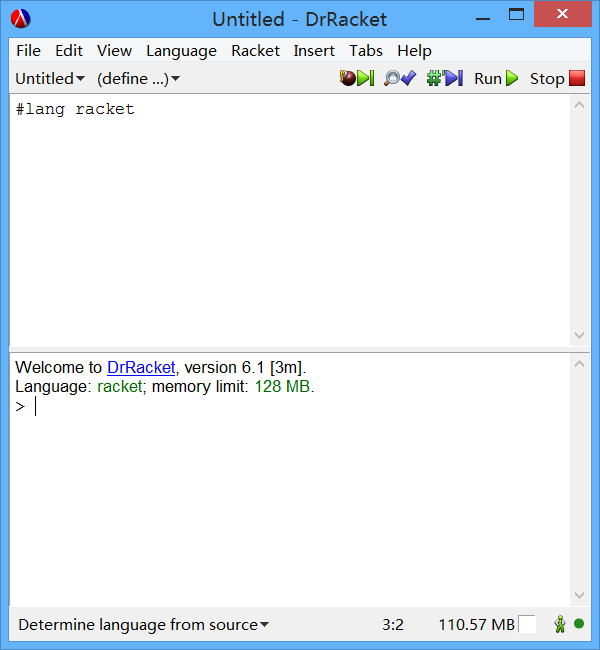

Have a try
==========

Let's launch the DrRacket first. On a GNU/Linux system, execute `drracket`
in any terminal or select DrRacket from something like Application Menu
will be OK.

On Windows, depends DrRacket could be found at either Start Menu or
start screen.


DrRacket IDE
------------

After the loading finished, 
the main window of DrRacket should be displayed and looks similar to below.



If you don't accustomed to using English, 
it is possible to choose another one from the Help menu item.

The most significant difference for people who are new to the
function programming language is that the User interface of IDE has been
divided into 2 frames vertically.

the top one is called code editor area and the bottom one is called 
REPL (which means Read-Evaluation-Print Loop) frame. That shows the progress of the execution progress of the
Scheme Programming Language. Instead of compiling the code into object
files, linking them together and executing the instruments of program 
one by one, Scheme uses a process called `evaluation`. 


Evaluation
----------

The word evaluation could be described as the following steps.

When the system get started, it provides you a blank environment called
`initial environment`, then you pass `expressions` to the system for
evaluation. The progress of evaluation includes parsing the expressions
passed in which is only a string of characters into an tree-like 
abstruct structure, and doing corresponding operations.

Let's try passing some expressions to it. 
The first one we are going to pass is:
```
"Hello World"
```

We type the code into the REPL frame, and press Enter.

It display the same message "Hello World" then. 
The system read the characters we typed in, it 
evaluates and print the result to us, this is the meaning of REPL. 
At this time we just need to know, almost all the programs execute like 
this.


